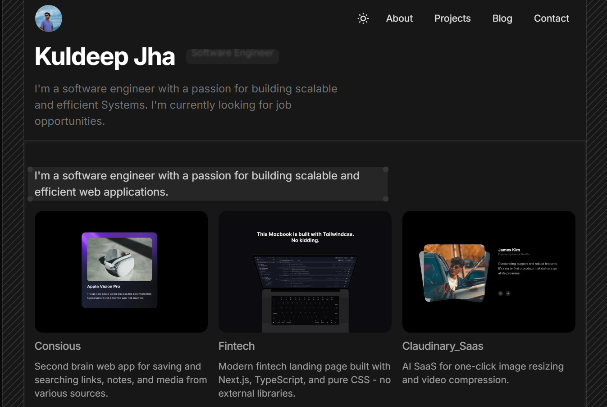

# 🚀 Kuldeep Jha - Personal Portfolio

A modern, responsive portfolio website built with Next.js 15, TypeScript, and Tailwind CSS. This project showcases my work, skills, and blog posts with a beautiful, animated interface.



## ✨ Features

### 🎨 **Modern Design & UX**

- **Dark/Light Mode Toggle** - Seamless theme switching with system preference detection
- **Smooth Animations** - Powered by Framer Motion for engaging user interactions
- **Responsive Design** - Optimized for all devices with mobile-first approach
- **View Transitions** - Next.js 15 view transitions for smooth page navigation
- **Glass Morphism Effects** - Beautiful backdrop blur and transparency effects

### 📱 **Interactive Components**

- **Animated Navigation** - Dynamic navbar with scroll effects and mobile menu
- **Project Showcase** - Interactive project cards with hover effects
- **Skills Section** - Animated skill bars and technology icons
- **Testimonials** - Carousel-style testimonials with smooth transitions
- **Contact Form** - Functional contact form with email integration
- **Blog System** - MDX-powered blog with syntax highlighting

### 🛠 **Technical Excellence**

- **TypeScript** - Full type safety throughout the application
- **Next.js 15** - Latest features including App Router and Server Components
- **Tailwind CSS 4** - Modern utility-first styling with custom animations
- **MDX Support** - Rich content authoring with React components
- **Email Integration** - Contact form powered by Resend API
- **SEO Optimized** - Meta tags, structured data, and performance optimization

## 🏗 Project Structure

```
pportfolio/
├── app/                    # Next.js App Router
│   ├── about/             # About page
│   ├── api/               # API routes (contact form)
│   ├── blog/              # Blog pages with dynamic routing
│   ├── contact/           # Contact page
│   ├── projects/          # Projects showcase page
│   ├── globals.css        # Global styles
│   ├── layout.tsx         # Root layout with providers
│   └── page.tsx           # Homepage
├── components/            # Reusable React components
│   ├── navbar/            # Navigation components
│   ├── ui/                # UI components (draggable cards)
│   └── *.tsx              # Feature components
├── constants/             # Project data and configuration
├── data/                  # MDX blog posts
├── lib/                   # Utility functions
├── public/                # Static assets
└── utils/                 # MDX processing utilities
```

## 🚀 Getting Started

### Prerequisites

- Node.js 18+
- npm, yarn, pnpm, or bun

### Installation

1. **Clone the repository**

   ```bash
   git clone https://github.com/yourusername/pportfolio.git
   cd pportfolio
   ```

2. **Install dependencies**

   ```bash
   npm install
   # or
   yarn install
   # or
   pnpm install
   # or
   bun install
   ```

3. **Set up environment variables**
   Create a `.env.local` file in the root directory:

   ```env
   RESEND_API_KEY=your_resend_api_key
   RESEND_FROM=your_verified_email@domain.com
   RESEND_TO=your_email@domain.com
   ```

4. **Run the development server**

   ```bash
   npm run dev
   # or
   yarn dev
   # or
   pnpm dev
   # or
   bun dev
   ```

5. **Open your browser**
   Navigate to [http://localhost:3000](http://localhost:3000) to see the result.

## 📝 Available Scripts

- `npm run dev` - Start development server
- `npm run build` - Build for production
- `npm run start` - Start production server
- `npm run lint` - Run ESLint

## 🎯 Key Features Breakdown

### 🏠 **Homepage**

- Hero section with animated introduction
- Featured projects showcase
- Latest blog posts preview
- Skills and technologies display
- Client testimonials

### 👨‍💻 **About Page**

- Personal introduction and story
- Professional timeline
- Travel collage with interactive elements
- Skills and expertise overview

### 💼 **Projects Page**

- Complete project portfolio
- Interactive project cards
- Live demo links
- Technology stack for each project

### 📚 **Blog System**

- MDX-powered content management
- Syntax highlighting for code blocks
- Responsive typography
- SEO-optimized blog posts
- Categories and tags support

### 📧 **Contact Page**

- Functional contact form
- Email integration via Resend
- Form validation
- Success/error notifications

## 🛠 Tech Stack

### **Frontend**

- **Next.js 15** - React framework with App Router
- **TypeScript** - Type-safe development
- **Tailwind CSS 4** - Utility-first CSS framework
- **Framer Motion** - Animation library
- **React Icons** - Icon library
- **Lucide React** - Modern icon set

### **Content Management**

- **MDX** - Markdown with React components
- **next-mdx-remote** - MDX processing
- **gray-matter** - Frontmatter parsing

### **Styling & UI**

- **Tailwind CSS** - Utility-first styling
- **class-variance-authority** - Component variants
- **clsx** - Conditional className utility
- **tailwind-merge** - Tailwind class merging

### **Email & Notifications**

- **Resend** - Email delivery service
- **Sonner** - Toast notifications

### **Development Tools**

- **ESLint** - Code linting
- **Prettier** - Code formatting
- **TypeScript** - Type checking

## 📱 Responsive Design

The portfolio is fully responsive and optimized for:

- **Desktop** - Full-featured experience with hover effects
- **Tablet** - Adaptive layout with touch-friendly interactions
- **Mobile** - Mobile-first design with optimized navigation

## 🎨 Customization

### **Colors & Themes**

The project uses CSS custom properties for easy theming:

```css
:root {
  --color-primary: #3b82f6;
  --color-secondary: #64748b;
  --color-neutral-50: #f8fafc;
  --color-neutral-950: #020617;
}
```

### **Adding New Projects**

Edit `constants/project.ts` to add new projects:

```typescript
export const projects: Project[] = [
  {
    title: "Your Project",
    description: "Project description",
    href: "https://your-project.com",
    src: "/project-image.jpg",
  },
];
```

### **Adding Blog Posts**

Create new `.mdx` files in the `data/` directory:

```mdx
---
title: "Your Blog Post"
description: "Blog post description"
date: "2024-01-01"
image: "/blog-image.jpg"
---

Your blog content here...
```

## 🚀 Deployment

### **Vercel (Recommended)**

1. Push your code to GitHub
2. Connect your repository to Vercel
3. Add environment variables in Vercel dashboard
4. Deploy automatically on every push

### **Other Platforms**

The project can be deployed to any platform that supports Next.js:

- Netlify
- Railway
- DigitalOcean App Platform
- AWS Amplify

## 📄 License

This project is open source and available under the [MIT License](LICENSE).


## 📞 Contact

- **Portfolio**: [https://kuldeep-portfolio-bice.vercel.app/](https://kuldeep-portfolio-bice.vercel.app/)
- **Email**: [ranacjha@gmail.com]
- **LinkedIn**: [kuldeep-jha-304985249]
- **GitHub**: [KuldeepJha5176]

---

⭐ **Star this repository if you found it helpful!**
